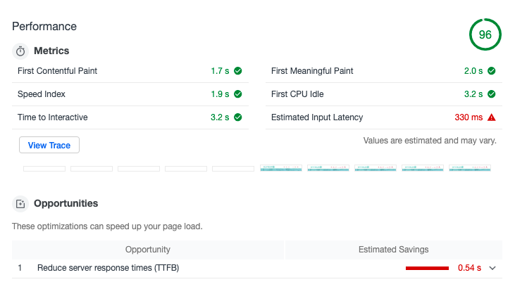

# Running benchmark
```
ab -n 20 -c 1 -r http://localhost:3000/ 
```

# Hypotheses 

1 - SSR + react is slow without caching mechanism.

**Pre server cache**
```
Requests per second:    1.32 [#/sec] (mean)
```


[Learn more](./ab-benchmark-20req-1cuncurrent-pre-cache.log)

**Post server cache**
```
Requests per second:    203.75 [#/sec] (mean)
```


[Learn more](./ab-benchmark-20req-1cuncurrent-post-cache.log)

**Result**

caching is effective to reduce the page load.


2 - adding max-age header on images on s3 might decrease the page load

[Learn more](https://gtmetrix.com/compare/nSh87LCi/0UP0a0iJ)

**Result**

the improvement is indeed tangible 


3 - by deferring images on rows `shop` and `industrial`, we can improve the performance of the page(page load)

**Pre deferring**


**Post deferring**


**Result**

the performance has been improved.

